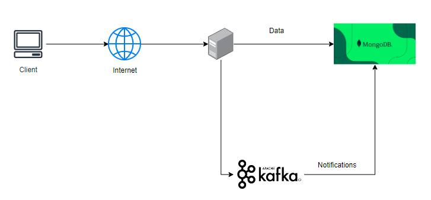

# Ecommerce website
## Overview:
- This project focuses on developing a robust backend with features like:
    + JWT authentication 
    + Product management
    + Discount management 
    + Rating products 
    + Notification when have new discount using kafka
    + Admin dashboard statistic
    + Using Cloudinary and Multer to save image in cloud 
    + Stripe payment integration
    + Post-payment notifications via Nodemailer

- Everyone can post their products for sale, create discounts for their items, and be featured on our homepage. Once a customer purchases your product, the payment will be transferred to your account.

- Technology: Nodejs, MongoDB, Cloudinary, Kafka, Reactjs, Tailwind

- Website: [https://hash-salt.vercel.app]

## Architecture

