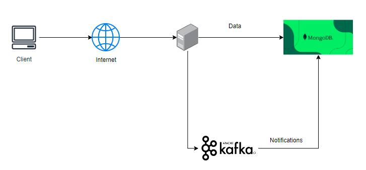

# Ecommerce website
## Overview:
- This project focuses on developing a robust backend with features like:
    + JWT authentication 
    + Product management
    + Discount management 
    + Rating products 
    + Notification when have new discount using kafka
    + Admin dashboard statistic
    + Using Cloudinary and Multer to save image in cloud 
    + Stripe payment integration
    + Post-payment notifications via Nodemailer

- Everyone can post their products for sale, create discounts for their items, and be featured on our homepage. Once a customer purchases your product, the payment will be transferred to your account.

- Technology: Nodejs, MongoDB, Cloudinary, Kafka, Reactjs, Tailwind

- Website: [https://hash-salt.vercel.app]

## Architecture

1. Client Interaction:

Users interact with the application through a web client. This client sends requests over the internet to the backend server, which is responsible for handling various functionalities, such as product management, user authentication, and more.

2. Backend Server:

The backend server processes incoming data requests from the client. This server is built using Node.js, which provides a scalable and efficient platform for handling HTTPS requests, interacting with the database, and managing other backend services.

3. Data Storage - MongoDB:

The application’s data, including user information, product details, discount management, cart details, order details,... is stored in MongoDB. MongoDB is a NoSQL database that efficiently handles large amounts of data, providing flexibility and scalability for the ecommerce platform.

4. Notification System - Kafka:

Apache Kafka is integrated into the architecture to handle real-time notifications. For instance, when a new discount is created or a product is purchased, Kafka is responsible for broadcasting these events to interested consumers, ensuring that users are notified promptly. This setup allows for scalable and reliable message brokering.